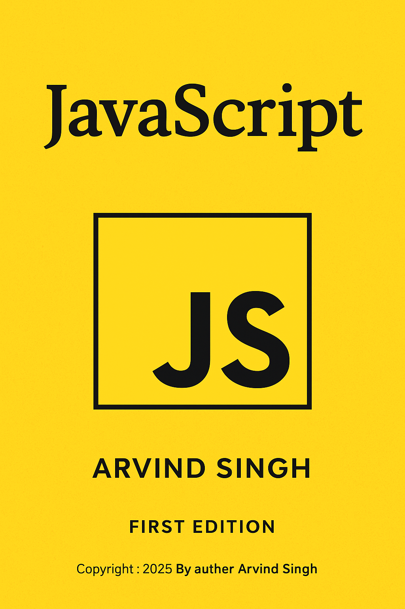

## Most Popular JavaScript Interview Questions and Answers

👋 Hello Developers!

**Welcome to my GitHub repository!** 🙏

I’ve created a curated collection of important JavaScript interview questions and answers designed specifically for experienced developers.

These questions cover core fundamentals, advanced concepts, real-world examples, and deep explanations across the entire JavaScript ecosystem.

**If you go through these Q&A sets, you will:**

✔ Improve your JavaScript knowledge

✔ Strengthen core concepts

✔ Prepare confidently for advanced-level interviews

✔ Understand JavaScript behavior with clear examples

---


<p align="center">
  
</p>


---

## 📌 1. What is Hoisting in JavaScript?


Hoisting is JavaScript's default behavior of moving variable and function declarations to the top of their scope before execution.

* `var` is hoisted and initialized with `undefined`.
* `let` and `const` are hoisted but **not initialized** (Temporal Dead Zone).


## ⚙️ Why Does Hoisting Happen in JavaScript?

Hoisting occurs because JavaScript code is executed in **two phases** inside the **Execution Context**. 

### **1️⃣ Creation Phase
During the creation phase, JavaScript prepares memory before executing your code.

* Memory is allocated for **variables**, **functions**, and **arguments**.
* **Function declarations** are hoisted with their full definitions.
* Variables declared with **`var`** are initialized with `undefined`.
* Variables declared with **`let`** and **`const`** are placed in the **Temporal Dead Zone (TDZ)** — memory is allocated but **not initialized**.
  
  ### TDZ: 
  The Temporal Dead Zone (TDZ) is the time frame between entering a scope and the actual initialization of variables declared with let or const. Accessing them during this time results in a ReferenceError.
  
  In simple word :
  the Temporal Dead Zone (TDZ) is the time between a variable’s declaration and its initialization. If you try to access the variable during this period, JavaScript throws a ReferenceError.

This explains why accessing `let` or `const` before initialization causes a **ReferenceError**.

### **2️⃣ Execution Phase

After memory allocation, JavaScript runs the code **line by line**.

* Variable assignments happen in this phase.
* Functions execute when called.


```js
console.log(a); // undefined
var a = 10;
```

---

## 📌 2. Difference Between `var`, `let`, and `const`?


| Feature   | var             | let   | const |
| --------- | --------------- | ----- | ----- |
| Scope     | Function        | Block | Block |
| Reassign  | Yes             | Yes   | No    |
| Redeclare | Yes             | No    | No    |
| Hoisting  | Yes (undefined) | TDZ   | TDZ   |

---

## 🚀 3. What Is the Event Loop in JavaScript?

The **Event Loop** is a core part of the **JavaScript runtime environment**, responsible for managing **asynchronous operations** without blocking the main thread.
Because JavaScript is **single-threaded**, means it can run only **one task at a time** inside a single **call stack**.

However, in the real life applications, developers need to perform multiple operations such as:
* Fetching API data
* Login & authentication
* Add to cart / Checkout process
* Sending emails

These tasks must run smoothly **without blocking the main thread or freezing the user interface** — To solve this problem,  **Event Loop** was introduced.


Even though JavaScript executes in a single thread, and in modern applications require running multiple tasks **concurrently**.


## ⚙️ How the Event Loop Works

### **1️⃣ JavaScript runs line by line (synchronous) code in the Call Stack**

### **2️⃣ Asynchronous operations are handled by Web APIs / Node APIs**

Examples:

* `setTimeout`
* `fetch()`
* File system calls
* Event listeners

### **3️⃣ When async tasks finish, callbacks are moved to queues**

There are two main queues:

* **Callback Queue** → Timers, DOM events
* **Microtask Queue** → Promises, async/await

### Phases of the Event Loop in JavaScript
JavaScript in the browser has 2 main phases:
1️⃣ Macro-task Queue 
   Examples of Macro-tasks:setTimeout, setInterval, DOM events (Click), callback
2️⃣ Micro-task Queue:
   High-priority queue — always executed before next macro-task
   Promise.then(), async/await 
### **4️⃣ Event Loop monitors the Call Stack**

If the Call Stack is **empty**, the Event Loop push callback (Promis & setTimeout) into Call Stack for execution.
 
 So Event loop is continuously checks the callback queue and if there are any Callback then move it from callback queue to call stack and execute.

---

## 📌 4. What are Promises?

A **Promise** is a JavaScript **object** that represents the *eventual result* of an asynchronous operation. It helps you write cleaner async code without falling into callback hell.

## 🧠 Why Do We Need Promises?

We all know that JavaScript is **single-threaded**, means it can execute only **one task at a time**.

But real-world applications require handling multiple asynchronous tasks such as:

* Database calls
* API requests
* File reading
* User authentication

Before promises, developers used **callbacks**, but nesting callbacks inside callbacks created callback Hell means complexity for understand and maintain code:

### ❌ Callback Hell
* Complex to read
* Hard to debug
* Difficult to maintain

To solve this problem, **ES6 introduced Promises**, providing a cleaner and more structured way to handle async code.

### ✔ A Promise have 3 States

1. **Pending** – The operation is the initial state.
2. **Fulfilled** – The operation completed successfully.
3. **Rejected** – The operation failed.

## 🔧 How to use Promises
Promises are consumed using:
* **`.then()`** → to handle success
* **`.catch()`** → to handle errors

### 📎 Example

```js
let fetchData = new Promise((resolve, reject) => {
  setTimeout(() => {
    resolve("Data received");
  }, 2000);
});

fetchData
  .then(response => console.log(response))  // if resolved
  .catch(error => console.error(error));    // if rejected    

```

---

## 📌 5. Difference Between Promise and Async/Await?

JavaScript handles asynchronous operations using **Promises** and **Async/Await**.  
Both help avoid blocking the main thread, but they work in different ways and provide different levels of readability and control.


## 📌 Key Differences (Table Format)

| Feature | Promise | Async/Await |
|--------|---------|--------------|
| **Definition** | Promises was introduce in ES6 (2015) | Async/await was introduce in ES8 (2017)  |
| **Syntax Style** | Uses `.then()` for success and `.catch()` for errors. | Uses `await` to pause execution and `try...catch` for error handling. |
| **Readability** | Can become messy (callback chain) if too many `.then()` are nested. | Looks like synchronous code and is more readable for complex chains. |
| **Error Handling** | Errors handled using `.catch()` block. | Errors handled using `try...catch`. |
| **Chaining** | Easy for multiple asynchronous operations using promise chaining. | Excellent for sequential operations, harder for parallel unless using `Promise.all()`. |
| **Best For** | Running tasks in parallel or when you need fine-grained control of chains. | Writing cleaner async code and sequential operations. |


### ✔ Example Using Promises


```js
function getData() {
  return new Promise((resolve, reject) => {
    setTimeout(() => {
      let success = true;

      if (success) {
        resolve("Data fetched successfully!");
      } else {
        reject("Failed to fetch data");
      }
    }, 2000);
  });
}

getData()
  .then(result => console.log(result))
  .catch(error => console.log(error));

```

### ✔ Example Using Async/Await

```js
function getData() {
  return new Promise((resolve, reject) => {
    setTimeout(() => {
      let success = true;

      if (success) {
        resolve("Data fetched successfully!");
      } else {
        reject("Failed to fetch data");
      }
    }, 2000);
  });
}

async function fetchData() {
  try {
    const result = await getData();
    console.log(result);
  } catch (error) {
    console.log(error);
  }
}

fetchData();


```


---

## 📌 6. What is Debouncing?

Debouncing delays function execution until after a certain time has elapsed since the last call. It ensures that a function is executed only after the user stops performing an action.
Real-Life Example (Very Simple) :  Imagine you are typing in search box. Every time you type a letter, And JavaScript could call an API.
Debouncing ensure only call API after user stops typing for a small milliseconds

Without Debounce ❌ (too many function calls) : like if Pressing keys: "H" "He" "Hel" "Hell" "Hello"  In that case API call 5 times.

With Debouncing user can stop API calling for some millisecond  and Only 1 API call

Used for: search boxes, window resize, scroll events.

```js
function debounce(fn, delay){
  let timer;
  return function(){
    clearTimeout(timer);
    timer = setTimeout(() => fn.apply(this, arguments), delay);
  }
}

function searchData(query) {
    document.getElementById("result").innerText =
      "Searching for: " + query;
  }

const debouncedSearch = debounce(searchData, 500);
```

---

## 📌 7. What is Throttling?


Allows a function to be executed only once in a given interval.

```js
function throttle(fn, limit){
  let flag = true;
  return function(){
    if(flag){
      fn();
      flag = false;
      setTimeout(()=> flag = true, limit);
    }
  }
}
```

---

## 📌 8. What is Closure?


Function that remembers its outer scope even after execution.
A function access to its outer (parent) scope that's is called closure. Closure is lexical variable. That means a inner function can access the parent variable.

```js

function createCounter(){
    let count = 0;
    return function increment(){
        count++;
        console.log("count :", count);
    }
}

const counter = createCounter();
counter();  // count : 1
counter();  // count : 2

```

---

## 📌 9. What is Callback?


a callback is a function , that is passed as an argument into another function.

```js

var greet = (name, callback)=>{
        console.log("Hello " + name);
        callback();
}
var sayBye_callback = ()=> {
  console.log("Goodbye!");
}

greet("Arvind", sayBye_callback);

```

---

## 📌 10. Explain Call, Apply, Bind.


In JavaScript, call, apply, and bind are methods used to change the value of this inside a function.

### **1️⃣ call()
Calls a function immediately with a specific this value

```js
const person = {
  name: "Arvind"
};
function greet(city, country) {
  console.log(`Hello ${this.name} from ${city}, ${country}`);
}
greet.call(person, "Varanasi", "India");

// Output
// Hello Arvind from Varanasi, India

```


### **2️⃣ apply()
Calls a function immediately and Passes arguments as an array

```js
const person = {
  name: "Arvind"
};
function greet(city, country) {
  console.log(`Hello ${this.name} from ${city}, ${country}`);
}
greet.apply(person, ["Varanasi", "India"]);

// Output
// Hello Arvind from Varanasi, India

```

### **3️⃣ bind()
Returns a new function, Does NOT call the function immediately, You can call the new function later
```js
const person = {
  name: "Arvind"
};
function greet(city, country) {
  console.log(`Hello ${this.name} from ${city}, ${country}`);
}
const newFunc = greet.bind(person, "Varanasi", "India");
newFunc(); // calling later

// Output
// Hello Arvind from Varanasi, India

```

---

## 📌 11. What is Execution Context?


Execution Context is the environment where JavaScript code is executed.
It is created in two phases — Creation Phase (memory allocation) and Execution Phase (code execution).
JavaScript uses Call Stack to manage execution contexts

Two Types of Execution Context

* Global Execution Context
* Function Execution Context

Each context has:

* Memory (Variable Environment)
* Code Execution Phase

---

## 📌 12. What is First-Class Function?

Functions treated as variables.

```js
const fn = () => {}
```

---

## 📌 13. What is the JavaScript Execution Process inside the V8 Engine?

```js
JS Source Code
↓
Parser (creates AST – Abstract Syntax Tree)
↓
Interpreter (Ignition – converts AST → Bytecode)
↓
JIT Compiler (Turbofan – optimizes & converts Bytecode → Machine Code)
↓
Execution (CPU runs the optimized machine code)
↓
Output

```

---

## 📌 14. What is the Event-Driven programming ?
Event-Driven programming means callback execute after an event.
We can write Event-Driven Programming in many ways : Callback, Promises, Async/Await, Event Listeners, Node.js EventEmitter
        
###  Example with Callbackes
 ```js
setTimeout(() => {
  console.log("Timer event triggered");
}, 2000);

```


###  Example with Promises
 ```js
fetch("/api/users")
  .then(res => res.json())
  .then(data => console.log("API Data:", data));

```


---

## 📌 15. What are the different data types present in JavaScript
### **1️⃣ Primitive types    
Primitive data types can store only a single value. 
Example of Primitive datatype - String , Number, BigInt, Boolean, Undefined, Null 
   
### **2️⃣ Non-primitive types 
non-primitive data types are used To store multiple and complex values.
 ```js
    var obj1 = {
   	x:  43,
   	y:  "Hello world!",
   	z: function(){
      		return this.x;
   	}
    }

  var array1 = [5, "Hello", true, 4.1];
```

---

## 📌 16. Explain the JavaScript Memory Leak.

CA memory leak happens when your JavaScript program keeps using memory but never releases it, even though it is no longer needed.
Because of leaks, your app becomes:
* Slower
* Laggy
* More RAM usage
* Eventually crashes

---

## 📌 17.Filter product in JavaScript using function?
```js

const getProducts =  () =>{
    const products = [
      {id:1,name:"tea", price:10, category:"beverage"},
      {id:2,name:"coffee", price:20, category:"beverage"},
      {id:3,name:"milk", price:30, category:"dairy"},
      {id:4,name:"water", price:15, category:"drink"},
    ];
    return products;
}

const filterProduct = (name, products)=>{
    const filterData = products.filter((product)=>product.name.toLowerCase().includes(name.toLowerCase()));
    console.log("Filter Data : ", filterData);
}

filterProduct("tea", getProducts());

```

---

## 📌 18. Filter product in JavaScript using promises?


```js
const getProducts = ()=> { 
return new Promise((resolve,reject) =>{
    const products = [
      {id:1,name:"tea", price:10,category:"beverage"},
      {id:2,name:"coffee", price:20,category:"beverage"},
      {id:3,name:"milk", price:30,category:"dairy"},
      {id:4,name:"water", price:15,category:"drink"},
    ];
    setTimeout(()=>{
        resolve(products);
    },1000);
});

}

const filterProduct = (name, products)=>{
    const filterData = products.filter((product)=>product.name.toLowerCase().includes(name.toLowerCase()));
    console.log("Filter Data : ", filterData);
}

getProducts().then((allProducts)=>{
    console.log("get data", allProducts);
    filterProduct("coffee", allProducts);
}).catch((error)=>{
    console.log("Error fetching products:", error);
});

```
---

## 📌 19. What is the Difference Between `==` and `===`?

* `==` → Compares values only (automatically converts data types to match)
* `===` → Compares value + data type

```js
5 == "5"   // true (string "5" is converted to number 5)
0 == false // true
null == undefined // true


5 === "5"   // false (number vs string)
0 === false // false
null === undefined // false

```

---

## 📌 20. Deep Copy vs Shallow Copy

**Shallow Copy:**
A shallow copy creates a new object

```js
const obj2 = {...obj1};
```

**Deep Copy:**
A deep copy creates a completely independent clone, INCLUDING all nested objects/arrays.

```js
const deep = JSON.parse(JSON.stringify(obj));
```

---

## 📌 21. What is the `this` Keyword?

`this` refers to the object that is executing the function.

Depends on:

* Global
* Method
* Constructor
* Arrow function


---

## 📌 22. What is a Module in JavaScript?

ES6 introduce module for reuseable code.
A module in JavaScript is a separate file that contains its own variables, functions, classes, etc.
and exports them so other files can import and use them.
It is reuseable code. Improves structure in large projects,Supports encapsulation,


```js
//module.js
export const PI = 3.14;

export function sum(a, b) {
  return a + b;
}

// main.js
import { PI, add } from './module.js';
console.log(sum(10, 20)); // 30
console.log(PI);          // 3.14

```

---

## 📌 23. What is Optional Chaining?

```js
a?.b?.c
```

Prevents errors when accessing nested properties.

---

## 📌 24. What is the Purpose of `use strict`?

use strict enables Strict Mode in JavaScript, which catches common coding errors, prevents unsafe actions (like using undeclared variables), avoids accidental globals, blocks deprecated features, and helps write cleaner and more secure code.

---

## 📌 25 How to run javascript code?
JavaScript run on the browser and Every browser has a JS engine:
| Browser | JS Engine          |
| ------- | ------------------ |
| Chrome  | **V8**             |
| Edge    | **V8**             |
| Firefox | **SpiderMonkey**   |
| Safari  | **JavaScriptCore** |
| Node.js | **V8**             |

engine read your JS code and Convert it to machine code and Execute it.

JS Engine breaks your code into 2 phases.

### Phase 1: Creation Phase:
Engine scans your code before running it.
Creates global execution context
Creates memory space
Stores variables & functions in memory

### Phase 2: Execution Phase
Engine runs the code line-by-line.
It assigns values to variables
It executes functions
It creates function execution contexts

### Execution Context
    There are 2 types:
    Global Execution Context (GEC) : Created once when script starts.
    It has Memory space for all global variables
    Function Execution Context (FEC): Wethr a function is called, JS creates a NEW execution context.

###  Call Stack (Execution Stack)
    All execution contexts are stored in a call stack and after finish remove the executation context.

## 📌 26. Array Functions in JavaScript (Popular)

* map()
* filter()
* reduce()
* forEach()
* find()
* some()
* every()
* sort()
* push/pop()
* shift/unshift()
* splice()
* Slice()


